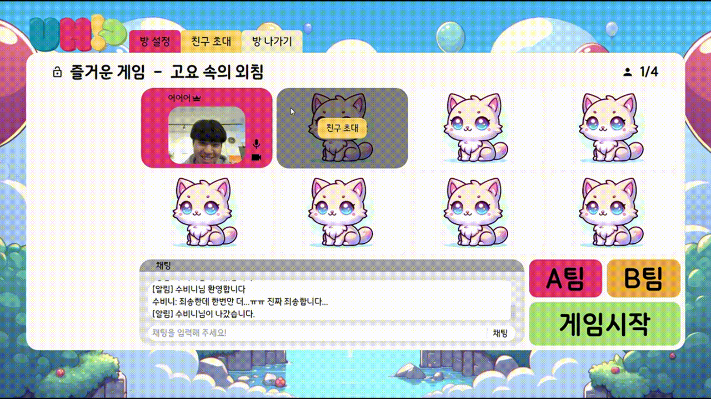
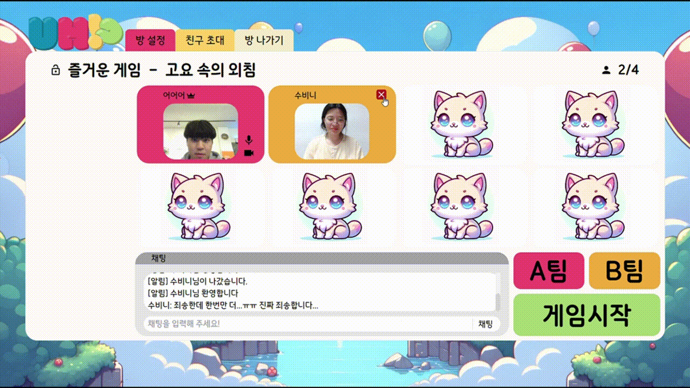
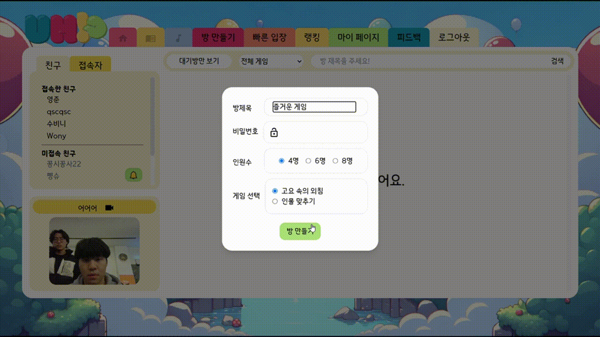
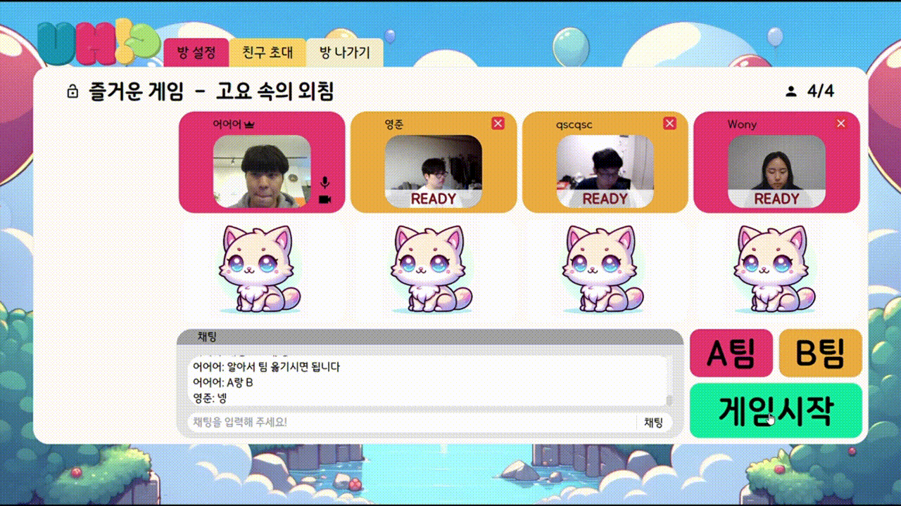
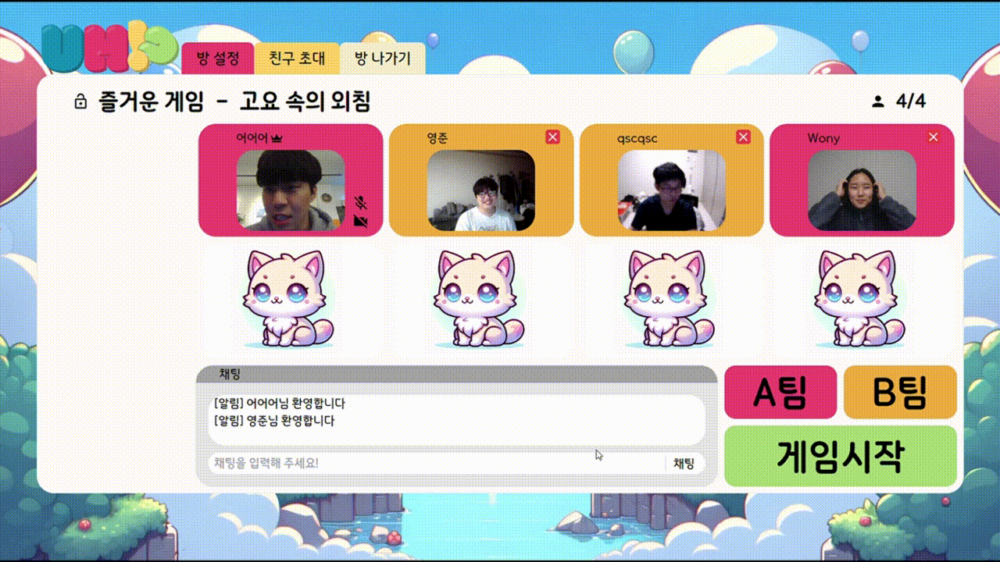
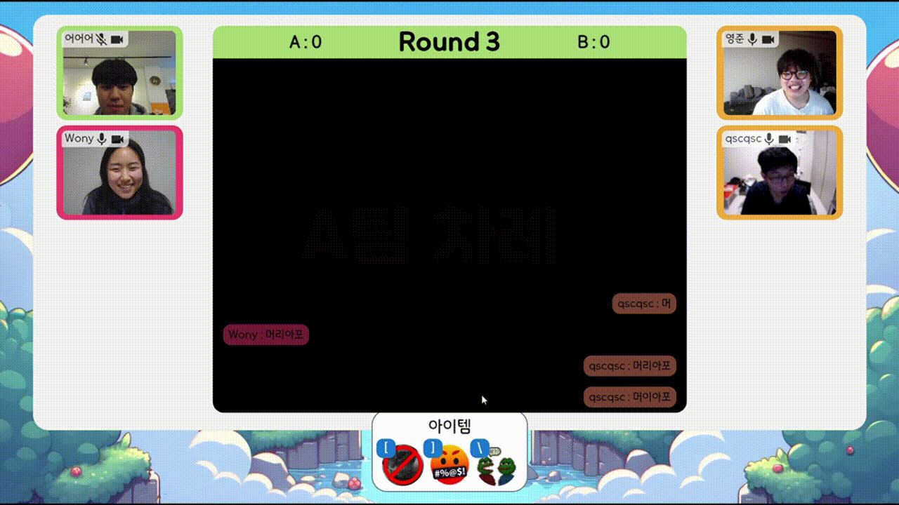
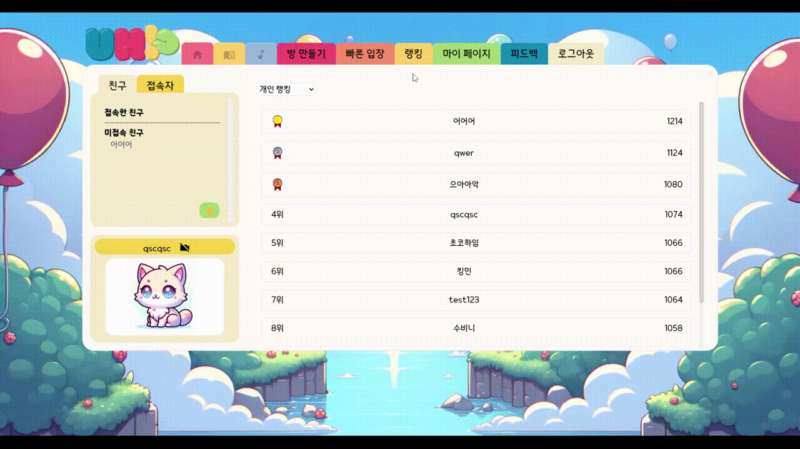

# UH!?

"UH!?"는 온라인 예능 게임 플래폼입니다.

- 물리적인 이유로 친구들을 쉽게 만나지 못하는 사람들
- 어색한 분위기 속, 아이스브레이킹이 필요한 사람들
- 예능 게임을 즐기고 싶은데, 여건이 되지 않는 사람들

에게 추천 드립니다.

## 기술스택

### FE

### BE

## 아키텍처

## 팀원

## 특장점

1. rating system을 통해서, 사용자들에게 유인 요소 추가
2. 게임 중 아이템(채팅창 막기, 문제 제출 화면 meme으로 대체. 초성 힌트, STT 힌트 ) 사용으로 active한 게임 경험 제공
3. 사용자들의 의견을 보낼 수 있는 피드백 페이지 제공
4. 친구 따라가기, 친구 초대를 이용하여, 친구와 교류하면서 게임 이용 가능
5. 게임에 대한 튜토리얼 제공
6. 방 생성 후, 대기방에서 정보를 수정할 수 있도록 구현 -> 사용하는 방 안에서 사용자들이 방 정보나 게임 종류를 변경할 수 있도록 구현
7. My Page을 통하여, 자신의 전적과 게임 등수 확인 가능
8. 잠금 방 생성을 통하여, 친구들끼리만 할 수 있는 환경 조성
9. 대기방만 보기, 게임별로 방 보기, 방 제목 검색 기능을 구현하여, 사용자가 원하는 방을 검색할 수 있도록 검색 기능 구현
10. 빠른 입장을 통하여, 사용자가 빠르게 게임할 수 있는 방에 접근하도록 구현
11. 고요 속의 외침시, 발화자의 마이크가 자동 음소거로 게임의 몰입력 상승
12. 대기방에서 방장이 방을 나갈 시, 게임 진행이 계속되도록 방장 넘김 구현
13. 대기방 내의 악성 사용자 제거를 위해서 강퇴 기능 구현
14. 인물 맞추기에서 사용자가 정답 입력시, 자동으로 팀 점수 rating system 구현
15. 게임 후, 승리 팀 축하를 위한, 폭죽 UI 제공
16. 사용자가 방 정보 변경 시, 자동으로 로비의 방 목록, 대기방의 방 정보 내용 변경

## 페이지 소개

### 로그인 & 닉네임

### 로그아웃 & 회원가입

### 로비 페이지

#### 친구신청 & 친구수락

#### 방만들기

### 대기방

#### 강퇴기능

#### 친구초대

### 게임: 고요속의 외침 설명

#### 게임 아이템: 화면가리기

#### 게임 아이템: STT

### 게임: 인물맞추기

#### 팀변경

#### 게임결과

### 랭킹 & 마이페이지

