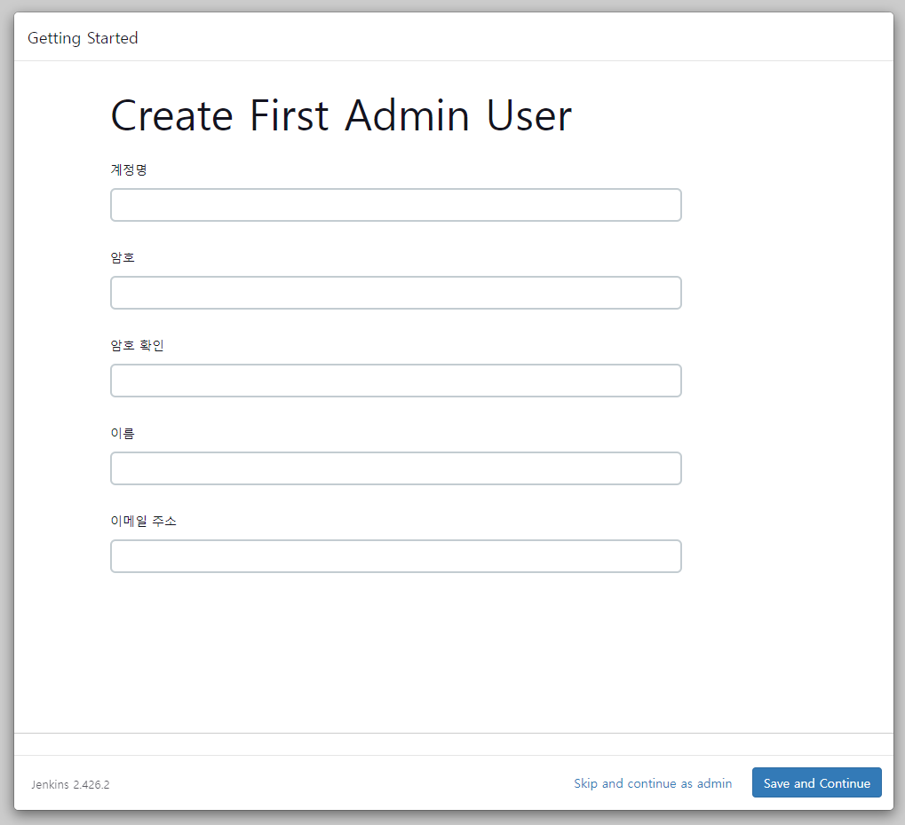

# 포팅 메뉴얼

# 버전 관리

## IDE

- Intellij IDEA 2023.3.2
- VS Code 1.85

## 개발 환경

### FE

- axios 1.6.5
- React 18.2.0
- styled-components 6.1.8
- tailwindcss 3.4.1
- zustand 4.5.0
- openvidu-browser 2.29.1

### BE

- SpringBoot 3.2.1
- JDK(Zulu 17.0.9)
- Python 3.11
- Flask 1.1.4

### DB

- MySQL 8.0.35

## 서버

- EC2 Ubuntu 20.04.6 LTS
- EC2(xlarge)
    - CPU: 4vCPUs
    - RAM: 16GB
    - SSD: 320GB

# 빌드 및 배보 환경 구축

## 빌드 환경

- NodeJS 20.10.0
- JDK(OpenJDK 17)

## 웹 서버 설치 및 SSL 인증

- 서버 시간 변경

```bash

sudo timedatectl set-timezone Asia/Seoul
```

### NGINX 설치

- 설치

```bash
sudo apt install nginx -y
```

### SSL 설정

```bash
sudo apt-get install letsencrypt
```

```bash
sudo apt-get install certbot python3-certbot-nginx
```

```bash
sudo certbot --nginx
```

```
- 이메일 입력
- 약관 동의: Y
- 이메일 수신동의
- 도메인 입력
- http 입력시 리다이렉트 여부: 2
```

- 설정

```bash
sudo vim /etc/nginx/sites-available/default
```

```bash
server {

    # index index.html index.htm index.nginx-debian.html;
    server_name localhost:3000; # managed by Certbot

    location / {
        root /var/www/html;
        index index.html index.htm index.nginx-debian.html;
        try_files $uri $uri/ /index.html;
    }

    location /api {
        proxy_pass http://localhost:8000/api;
        proxy_set_header X-Real-IP $remote_addr;
        proxy_set_header X-Forwarded-For $proxy_add_x_forwarded_for;
        proxy_set_header Host $http_host;
    }

    location /ws {  # WebSocket 설정 추가
        proxy_pass http://localhost:8000/ws;
        proxy_http_version 1.1;
        proxy_set_header Upgrade $http_upgrade;
        proxy_set_header Connection "upgrade";
        proxy_set_header Host $host;
        proxy_set_header X-Real-IP $remote_addr;
        proxy_set_header X-Forwarded-For $proxy_add_x_forwarded_for;
    }

    location /stt {
        proxy_pass http://localhost:5002/stt;
        proxy_set_header X-Real-IP $remote_addr;
        proxy_set_header X-Forwarded-For $proxy_add_x_forwarded_for;
        proxy_set_header Host $http_host;
    }

    listen [::]:443 ssl ipv6only=on; # managed by Certbot
    listen 443 ssl; # managed by Certbot
    ssl_certificate /etc/letsencrypt/live/localhost:3000/fullchain.pem; # managed by Certbot
    ssl_certificate_key /etc/letsencrypt/live/localhost:3000/privkey.pem; # managed by Certbot
    include /etc/letsencrypt/options-ssl-nginx.conf; # managed by Certbot
    ssl_dhparam /etc/letsencrypt/ssl-dhparams.pem; # managed by Certbot

}

server {
    if ($host = localhost:3000) {
        return 301 https://$host$request_uri;
    } # managed by Certbot

    listen 80 ;
    listen [::]:80 ;
    server_name localhost:3000;
    return 404; # managed by Certbot
}
```

```bash

sudo service nginx restart
```

```bash
sudo nginx -t
```

## 도커 및 젠킨스 설치

- 설치 및 설정
    - sudo apt-get update 안 되는 경우
    
    ```bash
    sudo apt-add-repository -r ppa:certbot/certbot
    sudo apt update
    sudo apt-get update
    ```
    
    - 도커 설치
    
    ```bash
    # Add Docker's official GPG key:
    sudo apt-get update
    sudo apt-get install ca-certificates curl gnupg
    sudo install -m 0755 -d /etc/apt/keyrings
    curl -fsSL https://download.docker.com/linux/ubuntu/gpg | sudo gpg --dearmor -o /etc/apt/keyrings/docker.gpg
    sudo chmod a+r /etc/apt/keyrings/docker.gpg
    
    # Add the repository to Apt sources:
    echo \
      "deb [arch=$(dpkg --print-architecture) signed-by=/etc/apt/keyrings/docker.gpg] https://download.docker.com/linux/ubuntu \
      $(. /etc/os-release && echo "$VERSION_CODENAME") stable" | \
      sudo tee /etc/apt/sources.list.d/docker.list > /dev/null
    sudo apt-get update
    ```
    
    ```bash
    sudo apt-get install docker-ce docker-ce-cli containerd.io docker-buildx-plugin docker-compose-plugin
    ```
    
    - 도커 컨테이너 마운트
        - 마운트 디렉토리 생성
            
            ```bash
            cd /home/ubuntu && mkdir jenkins-data
            ```
            
        - 접근 권한 변경
            
            ```bash
            sudo chmod 777 jenkins-data
            ```
            
        - 외부 접속 포트 오픈
            
            ```bash
            sudo ufw allow 8080/tcp
            sudo ufw reload
            sudo ufw status
            ```
            
        - 컨테이너 생성
            
            ```bash
            sudo docker run -d -p 8080:8080 -v /home/ubuntu/jenkins-data:/var/jenkins_home -v /usr/bin/docker:/usr/bin/docker -v /var/run/docker.sock:/var/run/docker.sock -u root --name jenkins --restart=on-failure jenkins/jenkins:lts-jdk17
            ```
            
        - 비번 확인
            
            ```bash
            sudo docker logs jenkins-server
            ```
            
            
            
    - 접속 url
        - YUOR-SERVER-PUBLIC-IP:PORT-NUM
            - http://localhost:8080/
    - Admin Password
        - 확인한 초기 비번 입력
            
            
            
    - 기본 설정
        - 플러그인 설치
            - Install suggested plugins
                
                
                
                
                
    - 계정 설정
        
        
        
    
    - Jenkins URL
        - 접속할 URL:Port Number 지정
            
            
            
- sudo 없이 도커 실행하기
    - 그룹 생성
    
    ```bash
    sudo groupadd docker
    ```
    
    - 사용자 추가
    
    ```bash
    sudo usermod -aG docker ${USER}
    
    // USER 안 되면 도메인 앞 id 입력
    // ex) ubuntu@ip-172-26-15-225 -> ubuntu
    ```
    
    - 도커 재시작
    
    ```bash
    sudo service docker restart
    ```
    

## Gitlab 연결

- 빌드 유발
    
    
    
    - Build when a change is pushed to GitLab. GitLab webhook URL: http://localhost:8080/project/Build%20Test 선택
    - webhook URL 기록
    - 고급
        - 시크릿 토큰 생성 및 기록
            
            
            
- Credentials
    - 깃랩 access token 생성
        - 토큰은 새로운 아이탬을 생성할 때마다 새롭게 생성해야 함
        
        
        
    - Credentials 생성 및 설정
        
        
        
        - Domain: Global credentials(unrestricted)
        - Kind: Username with password
        - Scope: Global (Jenkins, nodes, items, all child items, etc)
        - Username: 깃랩 아이디(이메일 전체 혹은 아이디 부분)
        - Password: 깃랩 access token
        - ID: 식별자(선택 사항)

## 파이프라인 설정

- 아이템 선택
    - 파이프라인
        
        
        
        - 프리스타일로 생성해도 무관
            - 쉘 스크립트를 사용하기 때문에 진입 장벽이 낮은 편
            - 하지만 각 과정에 대한 로그를 확인하기 불편
- 빌드 트리거 설정
    
    
    
    - 깃랩 연결했을 때와 동일하게 설정
- 기본 스크립트 작성
    
    ```bash
    pipeline {
        agent any
        
        tools {
          nodejs 'NodeJS 20.10.0'
        }
        
        environment {
            HOME_PATH = '/home/ubuntu'
        }
    
        stages {
            stage('Checkout') {
                steps {
                    // Connect to Gitlab
                    git branch: 'test_server', credentialsId: 'CICD', url: 'https://lab.ssafy.com/s10-webmobile1-sub2/S10P12E201.git'
                }
            }
            
            stage('Container Down') {
                steps {
                    sshagent(credentials: ['SSH']) {
                        sh '''
                        ssh -o StrictHostKeyChecking=no ubuntu@ "chmod +x ${HOME_PATH}/server-down.sh && ${HOME_PATH}/server-down.sh"
                        '''
                    }
                }
            }
    
            stage('Build - Backend') {
                steps {
                    // Change directory to the backend directory
                    dir('backend') {
                        sh "chmod +x gradlew"
                        // Clean the previous build results
                        sh "./gradlew clean"
                        // Build the project using Gradle
                        sh "./gradlew build"
                    }
                }
            }
            
            stage('Deploy - Backend') {
                steps {
                    dir('backend') {
                        script {
                            def dockerImageName = 'spring-boot:3.0'
                            sh "docker build -t ${dockerImageName} ."
                        }
                    }
                }
            }
            
            stage('Build - Frontend') {
                steps {
                    writeFile file: '/home/ubuntu/jenkins-data/workspace/fe_dev/frontend/.env', text: """
                        REACT_APP_REST_API_KEY=""
                        REACT_APP_REDIRECT_URI="https://localhost:3000/callback/kakao"
                        REACT_APP_LOGOUT_REDIRECT_URI="https://localhost:3000/auth/login"
                    """
                    // Change directory to the frontend directory
                    dir('frontend') {
                        sh "ls -al"
                        sh "cat .env"
                        sh "npm install"
                        // Build the project using npm
                        sh "CI=false npm run build"
                    }
                }
            }
            
            stage('Deploy - Frontend'){
                steps {
                    sshagent(credentials: ['SSH']) {
                        dir('frontend') {
                            sh '''
                            rm -rf node_modules
                            tar -cvf build.tar build
                            scp -o StrictHostKeyChecking=no /var/jenkins_home/workspace/CICD/frontend/build.tar ubuntu@:${HOME_PATH}
                            ssh -o StrictHostKeyChecking=no ubuntu@ "chmod +x ${HOME_PATH}/deploy.sh && ${HOME_PATH}/deploy.sh"
                            '''
                        }
                    }
                }
            }
            
            stage('Container Up') {
                steps {
                    sshagent(credentials: ['SSH']) {
                        sh '''
                        ssh -o StrictHostKeyChecking=no ubuntu@ "chmod +x ${HOME_PATH}/server-up.sh && ${HOME_PATH}/server-up.sh"
                        '''
                    }
                }
            }
        }
    }
    ```
    

## 도커 컴포즈

- 설치
    
    ```bash
    sudo curl -L https://github.com/docker/compose/releases/latest/download/docker-compose-$(uname -s)-$(uname -m) -o /usr/local/bin/docker-compose
    ```
    
    ```bash
    sudo chmod +x /usr/local/bin/docker-compose
    ```
    
    ```bash
    docker-compose version
    ```
    
- mysql 관리 폴더 생성
    
    ```bash
    
    mkdir test && sudo chmod 777 mysql-data
    ```
    
- docker-compose.yml 생성 및 작성
    
    ```bash
    cd /home/ubuntu
    vim docker-compose.yml
    ```
    
    ```bash
    version: '3'
    services:
      db:
        image: mysql:8.0.35
        container_name: UH_DB
        environment:
          MYSQL_ROOT_PASSWORD: ""
          MYSQL_DATABASE: "uh"
          MYSQL_TCP_PORT: 7923
        ports:
          - "7923:7923"
        volumes:
          - ./jenkins-data/workspace/CICD/UH.sql:/docker-entrypoint-initdb.d/init.sql
          - ./mysql-data:/var/lib/mysql
        command:
          - --character-set-server=utf8mb4
          - --collation-server=utf8mb4_unicode_ci
        restart: on-failure
        networks:
         - backend
    
      backend:
        image: spring-boot:3.0
        container_name: UH_backend
        ports:
          - "8000:5000"
        depends_on:
          - db
        environment:
          SPRING_DATASOURCE_URL: "jdbc:mysql://db:7923/uh?serverTimezone=Asia/Seoul"
          SPRING_DATASOURCE_DRIVER: "com.mysql.cj.jdbc.Driver"
          SPRING_DATASOURCE_USERNAME: ""
          SPRING_DATASOURCE_PASSWORD: ""
        restart: on-failure
        networks:
         - backend
    
    networks:
      backend:
    ```
    
- 프론트 빌드용 쉘 스크립트 작성

```bash
#!/bin/bash

#1
echo "Make directory..."
mkdir front
cd front

#2
echo "Extracting build files..."
mv /home/ubuntu/build.tar .
tar -xvf ./build.tar

#3
echo "Copying build files to deployment directory..."
sudo cp -r ./build/* /var/www/html

#4
echo "Delete directory..."
cd ..
rm front -r

#5
echo "Restarting web server..."
sudo service nginx restart
```

- 서버 실행 쉘 스크립트

```bash
#!/bin/bash

nginx_status=$(ps aux | grep '[n]ginx' | awk '{print $2}')
compose_status=$(docker-compose ps -q)

if [ -z "$nginx_status" ]; then
    echo "NGINX is not running. Starting it up..."
    sudo service nginx start
else
    echo "NGINX is already running."
fi

if [ -z "$compose_status" ]; then
    echo "Docker Compose is not running. Starting it up..."
    docker-compose up -d
else
    echo "Docker Compose is already running."
fi
```

- 서버 중단 쉘 스크립트

```bash
#!/bin/bash

nginx_status=$(ps aux | grep '[n]ginx' | awk '{print $2}')
compose_status=$(docker-compose ps -q)
backend_status=$(docker images -q spring-boot)

if [ -z "$nginx_status" ]; then
    echo "NGINX is already dwon."
else
    echo "NGINX is running. Shutting it down..."
    sudo service nginx stop
fi

if [ -n "$compose_status" ]; then
    echo "Docker Compose is running. Shutting it down..."
    docker-compose down
else
    echo "Docker Compose is already down."
fi

if [ -n "$backend_status" ]; then
    echo "Backend Server image exists. Removing..."
    docker rmi "$backend_status"
else
    echo "Backend image doesn't exist."
fi
```

## SSH 인증 정보 등록

- pem키를 메모장으로 열어, 키 내용 전체를 Private Key에 등록


# openvidu 서버

- 포트 허용

```bash
ufw allow ssh
ufw allow 80/tcp
ufw allow 443/tcp
ufw allow 3478/tcp
ufw allow 3478/udp
ufw allow 40000:57000/tcp
ufw allow 40000:57000/udp
ufw allow 57001:65535/tcp
ufw allow 57001:65535/udp
ufw enable
```

- 배포
    - version 2.29.0

```bash
sudo su
```

```bash
cd /opt
```

```bash
curl https://s3-eu-west-1.amazonaws.com/aws.openvidu.io/install_openvidu_latest.sh | bash
```

- 설정

```bash
cd openvidu
```

```bash
vim .env
```

```bash
DOMAIN_OR_PUBLIC_IP=localhost:3000

OPENVIDU_SECRET=

CERTIFICATE_TYPE=letsencrypt

LETSENCRYPT_EMAIL=

HTTP_PORT=4442

HTTPS_PORT=4443
```

```bash
./openvidu start
```

## Whisper 서버
```bash
cd jenkins-data/workspace/CICD
```

```bash
cp -r flask /home/ubuntu
cd /home/ubuntu/flask
```

```bash
docker build -t whisper-api .
```

```bash
docker run -p 5002:5002 whisper-api
```

# 소셜 로그인
* 카카오 로그인 api
    * https://developers.kakao.com/docs/latest/ko/kakaologin/rest-api
